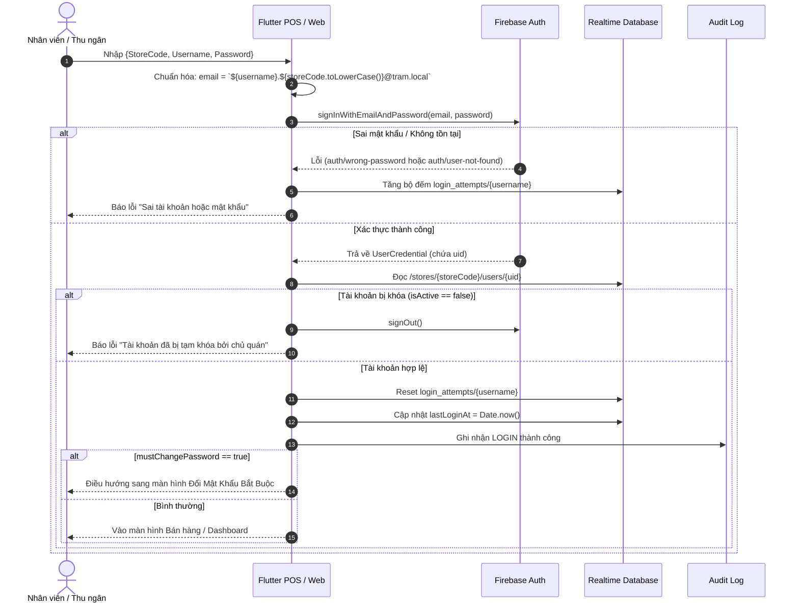
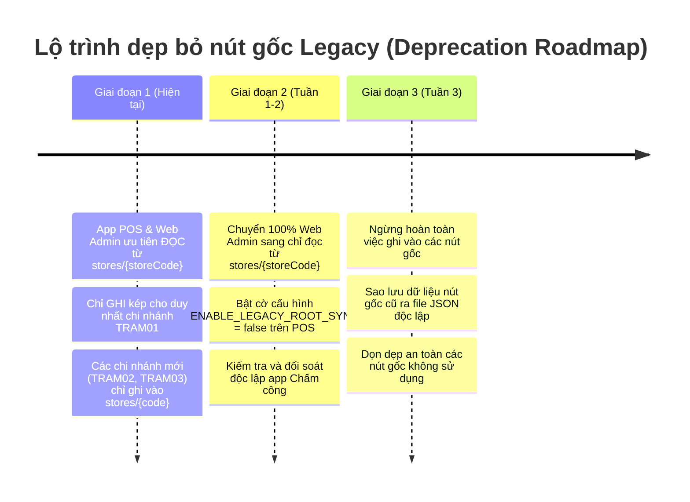

# HỢP ĐỒNG THIẾT KẾ XÁC THỰC & PHÂN QUYỀN BẢO MẬT (AUTH CONTRACT)
## HỆ THỐNG POS TRẠM F&B (MULTI-TENANT STORE ECOSYSTEM)
**Mã tài liệu:** `DOCS-AUTH-CONTRACT-2026-01`  
**Phiên bản:** `2.0.0`  
**Áp dụng cho:** `app_flutter` (POS Cashier/Staff/Kitchen), `web` (Admin Dashboard), Firebase Cloud Functions.  
**Trạng thái:** Dự thảo chuyển giao kỹ thuật (Chờ phê duyệt).

---

## 1. MỤC TIÊU & TỔNG QUAN HỆ THỐNG

Tài liệu này xác lập hợp đồng kỹ thuật chuẩn mực cho phân hệ Xác thực (Authentication) và Phân quyền (Authorization / RBAC) của hệ thống **POS Trạm**.
- **Chấm dứt hoàn toàn việc lưu mật khẩu dạng văn bản thô (Plaintext Password)** trong Firebase Realtime Database.
- **Chuyển giao 100% luồng xác thực danh tính** sang dịch vụ tiêu chuẩn **Firebase Authentication** (Email & Password).
- **Chuẩn hóa kiến trúc phân quyền đa chi nhánh (Multi-Tenant)**: Phân tách độc lập dữ liệu theo từng cửa hàng tại nút `/stores/{storeCode}`, bảo vệ chủ quyền của Chủ quán (`isRootOwner` / Sovereign Owner Rule).
- **Tương thích an toàn tuyệt đối với ứng dụng dùng chung Firebase**: Không gây gián đoạn hoặc phá hỏng hệ thống "Chấm công Trạm" đang cùng hoạt động trên Firebase Project.

---

## 2. BỐI CẢNH DỰ ÁN FIREBASE DÙNG CHUNG ("CHẤM CÔNG TRẠM")

### 2.1. Hiện trạng hạ tầng chia sẻ
Hệ thống POS Trạm và ứng dụng Chấm công Trạm đang chia sẻ chung một Firebase Project duy nhất:
- **Project ID**: `chamcongtram`
- **Auth Domain**: `chamcongtram.firebaseapp.com`
- **Database URL**: `https://chamcongtram-default-rtdb.asia-southeast1.firebasedatabase.app` (hoặc tương đương)
- **Storage Bucket**: `chamcongtram.firebasestorage.app`

Do dùng chung hạ tầng, mọi thay đổi về Firebase Security Rules và Firebase Authentication User Pool đều có nguy cơ ảnh hưởng trực tiếp đến ứng dụng Chấm công nếu không được phân lập chặt chẽ.

### 2.2. Phân loại nút gốc Realtime Database
Hợp đồng xác định ranh giới sở hữu dữ liệu giữa hai hệ thống:

| Nhóm nút | Đường dẫn trên RTDB | Đơn vị sở hữu | Mô tả & Quy ước quản lý |
| :--- | :--- | :--- | :--- |
| **Nút POS Multi-Tenant (Độc quyền)** | `/stores/{storeCode}/*` | **POS Trạm** | Chứa toàn bộ dữ liệu nghiệp vụ F&B của từng chi nhánh: `storeInfo`, `roles`, `users`, `categories`, `products`, `zones`, `tables`, `bills`, `promotions`, `kitchen_orders`, `online_orders`, `audit_logs`, `cash_shifts`, `kmt_customers`, `inventory_items`, `suppliers`, `purchase_receipts`, `stocktakes`, `transfers`, `waste_records`, `campaigns`. |
| **Nút POS Kế thừa (Legacy Dual-Sync)** | `/tables`<br>`/products`<br>`/categories`<br>`/zones`<br>`/history`<br>`/audit_logs`<br>`/online_orders`<br>`/kitchen_orders`<br>`/kmt_customers` | **POS Trạm (Legacy)** | Nút gốc từ phiên bản 1.0 (trước khi phân tách multi-tenant). Hiện POS Trạm vẫn đang ghi đồng thời sang các nút này cho chi nhánh `TRAM01`. Đang trong lộ trình cắt bỏ. |
| **Nút Người dùng gốc** | `/users` | **Dùng chung / Chấm công** | Chứa danh sách tài khoản theo cấu trúc cũ. Hệ thống Chấm công Trạm có thể đang đọc/ghi vào nút này để định danh nhân viên chấm công. **Tuyệt đối không xóa hoặc khóa đột ngột nút này.** |
| **Nút Chấm công Trạm (Ngoại vi)** | `/cham_cong`<br>`/chamcong`<br>`/timekeeping`<br>`/attendance`<br>`/employees`<br>`/shifts`<br>`/workshifts`<br>`/salaries`<br>`/devices`<br>`/wifi_configs`<br>`/face_data`<br>`/gps_locations`... | **Chấm công Trạm** | Thuộc hoàn toàn về hệ thống Chấm công Trạm. POS Trạm **không được đọc, ghi hay can thiệp bảo mật** vào các nút này. |

### 2.3. Quy tắc đặt Email Firebase Authentication cho POS Trạm
Hệ sinh thái Firebase Auth có User Pool dùng chung cho toàn bộ project. Để nhân viên POS đăng nhập bằng `username` + `storeCode` mà không bị xung đột với tài khoản nhân viên bên app Chấm công (vốn có thể dùng email thật hoặc format riêng):

#### Quy ước định dạng email ảo nội bộ:
$$\text{Email} = \text{\{username\}}.\text{\{storeCode\}}@\text{tram.local}$$

- **Định dạng:** Chữ thường toàn bộ (`lowercase`).
- **Domain:** Luôn cố định là `@tram.local`.
- **Dấu chấm ngăn cách (`.`):** Tách biệt rõ ràng giữa `{username}` và `{storeCode}`.

#### Quy tắc chuẩn hóa Username:
1. **Ký tự cho phép:** Chỉ gồm chữ cái tiếng Anh thường (`a-z`), số (`0-9`), gạch dưới (`_`), gạch ngang (`-`).
2. **Ký tự cấm:** Tuyệt đối không chứa dấu chấm (`.`), khoảng trắng (` `), ký tự có dấu tiếng Việt (`á`, `à`, `ê`...), ký tự đặc biệt (`@`, `#`, `$`, `%`...).
3. **Độ dài hợp lệ:** Tối thiểu 3 ký tự, tối đa 30 ký tự.
4. **Biểu thức chính quy (Regex):** `^[a-z0-9_-]{3,30}$`
5. **Chuẩn hóa StoreCode:** Chuyển đổi toàn bộ thành chữ thường khi sinh email auth: `storeCode.trim().toLowerCase()`.

#### Bảng ví dụ kiểm thử (Test Cases):

| Store Code nhập | Username nhập | Email Firebase Auth sinh ra | Trạng thái | Ghi chú |
| :--- | :--- | :--- | :--- | :--- |
| `TRAM01` | `thungan1` | `thungan1.tram01@tram.local` | **Hợp lệ** | Thu ngân ca 1 chi nhánh TRAM01 |
| `TRAM01` | `admin` | `admin.tram01@tram.local` | **Hợp lệ** | Quản trị chi nhánh TRAM01 |
| `TRAM02` | `bep_truong` | `bep_truong.tram02@tram.local` | **Hợp lệ** | Bếp trưởng chi nhánh TRAM02 |
| `tram01` | `ql-kho` | `ql-kho.tram01@tram.local` | **Hợp lệ** | Tự động chuẩn hóa storeCode thành chữ thường |
| `TRAM01` | `thu ngan` | *Từ chối (Lỗi validation)* | **Không hợp lệ** | Chứa dấu cách |
| `TRAM01` | `thu.ngan` | *Từ chối (Lỗi validation)* | **Không hợp lệ** | Chứa dấu chấm (gây xung đột tách chuỗi) |
| `TRAM01` | `thu_ngân` | *Từ chối (Lỗi validation)* | **Không hợp lệ** | Chứa ký tự tiếng Việt có dấu |
| `TRAM01` | `ab` | *Từ chối (Lỗi validation)* | **Không hợp lệ** | Quá ngắn (< 3 ký tự) |

### 2.4. Quy trình triển khai Security Rules an toàn
1. **Bước 1 - Sao lưu rules đang chạy:**
   ```bash
   firebase database:get /.settings/rules.json > backup_rules_before_pos_v2_$(date +%Y%m%d_%H%M%S).json
   ```
2. **Bước 2 - Đối chiếu Rules hiện tại:** Tải rules đang áp dụng trên Console, xác định chính xác các node Chấm công đang mở quyền để giữ nguyên nguyên trạng cho Chấm công.
3. **Bước 3 - Kiểm thử trên Firebase Local Emulator Suite:** Chạy thử nghiệm đồng thời cả app POS và kịch bản test của Chấm công trên emulator cổng `9000`.
4. **Bước 4 - Triển khai có giám sát (Canary / Off-peak Deploy):** Deploy vào khung giờ quán vắng khách (ví dụ 23:30 - 00:00).
5. **Bước 5 - Kế hoạch Rollback tức thì (< 30 giây):**
   Nếu bên app Chấm công báo lỗi quyền (`PERMISSION_DENIED`), khôi phục rules cũ ngay lập tức bằng lệnh:
   ```bash
   firebase database:set /.settings/rules.json backup_rules_before_pos_v2_*.json --confirm
   ```

---

## 3. CẤU TRÚC HỒ SƠ NGƯỜI DÙNG TẠI `/stores/{storeCode}/users/{uid}`

### 3.1. Chuyển đổi Key định danh: Từ `username` sang `uid`
- **Phiên bản cũ:** Lưu tại `/stores/{storeCode}/users/{username}` (Key là username, bên trong lưu `password: "123"`).
- **Hợp đồng mới:** Lưu tại `/stores/{storeCode}/users/{uid}` trong đó `{uid}` là Firebase Authentication User UID duy nhất.
- **Lợi ích:** Đồng nhất trực tiếp với biến `auth.uid` trong Security Rules, đảm bảo tính toàn vẹn dữ liệu, không bị lỗi khi sửa đổi thông tin hiển thị.

### 3.2. Đặc tả các trường trong User Profile
```json
{
  "uid": "ABc123xYz456FirebaseUidAuth",
  "username": "thungan1",
  "fullName": "Nguyễn Thu Ngân",
  "roleId": "ROLE_CASHIER",
  "isRootOwner": false,
  "customPermissions": [
    "MANUAL_DISCOUNT",
    "SPLIT_MERGE_ORDER"
  ],
  "isActive": true,
  "phone": "0912345678",
  "createdAt": 1771900000000,
  "lastLoginAt": 1771902400000,
  "mustChangePassword": false
}
```

#### Chi tiết định dạng các trường:
1. `uid` *(string, bắt buộc)*: Khóa chính, khớp 100% với `request.auth.uid`.
2. `username` *(string, bắt buộc)*: Tên đăng nhập chuẩn hóa, duy nhất trong cùng chi nhánh.
3. `fullName` *(string, bắt buộc)*: Họ và tên nhân viên hiển thị trên bill, KDS và báo cáo.
4. `roleId` *(string, bắt buộc)*: Mã định danh vai trò (xem Mục 4).
5. `isRootOwner` *(boolean, mặc định: false)*: Cờ xác định Chủ quán tối cao.
6. `customPermissions` *(array of strings, tùy chọn)*: Danh sách quyền bổ sung riêng lẻ cấp cho nhân viên, vượt ra ngoài vai trò mặc định.
7. `isActive` *(boolean, mặc định: true)*: Trạng thái tài khoản. Nếu `false`, hệ thống từ chối đăng nhập và hủy phiên làm việc ngay lập tức.
8. `phone` *(string, tùy chọn)*: Số điện thoại liên hệ của nhân viên.
9. `createdAt` *(number, timestamp UTC ms)*: Thời điểm tạo tài khoản.
10. `lastLoginAt` *(number, timestamp UTC ms)*: Thời điểm đăng nhập thành công gần nhất.
11. `mustChangePassword` *(boolean, mặc định: false)*: Cờ bắt buộc đổi mật khẩu ở lần đăng nhập kế tiếp (khi tạo mới tài khoản hoặc vừa được quản trị viên đặt lại mật khẩu).

> [!CAUTION]
> **NGUYÊN TẮC BẢO MẬT TUYỆT ĐỐI:**  
> Tuyệt đối **KHÔNG ĐƯỢC** lưu trữ trường `password` trong bất kỳ nút nào của Realtime Database. Mật khẩu phải được mã hóa và bảo vệ độc quyền bởi Firebase Authentication.

### 3.3. Vị trí mã nguồn tham chiếu
- **Vị trí mới (Sau khi phân tách):**
  - Flutter Model: `app_flutter/lib/data/models/user_model.dart`
  - Flutter Auth Service: `app_flutter/lib/core/services/auth_service.dart`
  - Web Context: `web/lib/data-context.tsx` (`UserItem`), `web/lib/auth.tsx`
- **Vị trí cũ tham chiếu đối chiếu:**
  - `app_flutter/lib/data/models/app_models.dart:129-208` (`class UserModel`)
  - `app_flutter/lib/data/services/firebase_service.dart:230-265` (`Future<UserModel?> login`)
  - `web/lib/auth.tsx:41-143` (`login`)

---

## 4. DANH SÁCH VAI TRÒ CHUẨN & MA TRẬN PHÂN QUYỀN (RBAC MATRIX)

Hệ sinh thái Trạm chuẩn hóa 4 vai trò gốc theo quy định tại `app_permissions.dart` (`enum UserRole`):

### 4.1. Bảng danh mục Vai trò (Standard Roles)
| Role ID (`roleId`) | Nhãn hiển thị | Cấp bậc | Ý nghĩa nghiệp vụ |
| :--- | :--- | :---: | :--- |
| `owner` / `ROLE_OWNER` | **Chủ cửa hàng** | Cấp 0 | Nắm toàn quyền tối cao của cửa hàng. Không ai có thể khóa, xóa hay hạ quyền của Chủ quán. |
| `manager_1` / `ROLE_MANAGER_1` | **Quản lý 1** | Cấp 1 | Điều hành toàn diện bán hàng, kho hàng, nhập hàng, khuyến mãi nâng cao, quản lý ca két, chiết khấu và báo cáo doanh thu. |
| `manager_2` / `ROLE_MANAGER_2` | **Quản lý 2** | Cấp 2 | Giám sát ca làm việc, điều phối bàn, in bill, duyệt chuyển bàn, xem báo cáo ca két và bán hàng cơ bản. |
| `employee` / `ROLE_CASHIER` / `ROLE_STAFF` / `ROLE_KITCHEN` | **Nhân viên** | Cấp 3 | Nhân viên thu ngân, phục vụ, tiếp thực, bếp/bar: nhận order, gửi bếp, thanh toán, in bill. |

### 4.2. Ma trận phân quyền chi tiết (Permission Matrix)
Dựa trên 20+ quyền định nghĩa tại `app_flutter/lib/core/permissions/app_permissions.dart`:

| Nhóm chức năng | Mã quyền (`AppPermissions.*`) | Nhạy cảm? | Owner | Manager 1 | Manager 2 | Employee |
| :--- | :--- | :---: | :---: | :---: | :---: | :---: |
| **Thực đơn & Giá bán** | `VIEW_MENU` | Không |  Có |  Có |  Có |  Có |
| | `EDIT_MENU` | Không |  Có |  Có | Không | Không |
| | `DELETE_MENU` | Không |  Có | Không | Không | Không |
| | `CHANGE_PRICE` | Không |  Có |  Có | Không | Không |
| **Bàn & Gọi món** | `OPEN_TABLE` | Không |  Có |  Có |  Có |  Có |
| | `CHANGE_TABLE` | Không |  Có |  Có |  Có |  Có |
| | `MERGE_SPLIT_TABLE` | Không |  Có |  Có |  Có | Không |
| | `SEND_KITCHEN` | Không |  Có |  Có |  Có |  Có |
| | `CANCEL_KITCHEN_ITEM` | **Nhạy cảm** |  Có |  Có | Không | Không |
| **Hóa đơn & Thanh toán** | `CREATE_BILL` | Không |  Có |  Có |  Có |  Có |
| | `EDIT_BILL` | Không |  Có |  Có | Không | Không |
| | `APPLY_PROMOTION` | Không |  Có |  Có |  Có |  Có |
| | `MANUAL_DISCOUNT` | **Nhạy cảm** |  Có |  Có | Không | Không |
| | `CANCEL_BILL` | **Nhạy cảm** |  Có |  Có | Không | Không |
| | `PRINT_BILL` | Không |  Có |  Có |  Có |  Có |
| | `REPRINT_BILL` | **Nhạy cảm** |  Có |  Có | Không | Không |
| **Ca két & Dòng tiền** | `MANAGE_CASH_SHIFT` | Không |  Có |  Có |  Có | Không |
| | `ADJUST_CASH_SHIFT` | **Nhạy cảm** |  Có |  Có | Không | Không |
| **Báo cáo & Kiểm toán** | `VIEW_REPORTS` | Không |  Có |  Có |  Có | Không |
| | `VIEW_AUDIT_LOGS` | **Nhạy cảm** |  Có |  Có | Không | Không |
| **Quản trị hệ thống** | `MANAGE_USERS` | **Nhạy cảm** |  Có | Không | Không | Không |
| | `MANAGE_ROLES_PERMISSIONS` | **Nhạy cảm** |  Có | Không | Không | Không |
| | `MANAGE_PROMOTIONS` | Không |  Có |  Có | Không | Không |
| | `MANAGE_STORE_SETTINGS` | **Nhạy cảm** |  Có | Không | Không | Không |
| **Kho hàng & NCC** | `VIEW_INVENTORY` | Không |  Có |  Có | Không | Không |
| | `VIEW_COST_PRICE` | **Nhạy cảm** |  Có |  Có | Không | Không |
| | `CREATE_RECEIPT` / `COMPLETE_RECEIPT` | Không |  Có |  Có | Không | Không |
| | `APPROVE_STOCKTAKE` | **Nhạy cảm** |  Có |  Có | Không | Không |
| | `RECORD_SUPPLIER_PAYMENT` | **Nhạy cảm** |  Có |  Có | Không | Không |
| **Khuyến mãi nâng cao** | `CREATE_CAMPAIGN` / `EDIT_CAMPAIGN` | Không |  Có |  Có | Không | Không |
| | `MANAGE_CODES` | **Nhạy cảm** |  Có |  Có | Không | Không |
| | `OVERRIDE_MANUAL_DISCOUNT` | **Nhạy cảm** |  Có | Không | Không | Không |

> [!NOTE]
> Mọi thao tác thuộc nhóm **Nhạy cảm** (`isSensitive == true`) bắt buộc phải được ghi nhận vết vào bảng `/stores/{storeCode}/audit_logs` kèm ảnh chụp trạng thái trước và sau thao tác (`beforeState` và `afterState`).

---

## 5. QUY TẮC BẢO MẬT REALTIME DATABASE (`database.rules.json`)

### 5.1. Nguyên tắc thiết kế Rules
1. **Cô lập Store-Level:** Người dùng chỉ có quyền đọc/ghi dữ liệu trong phạm vi `stores/{storeCode}` mà tài khoản của họ trực thuộc.
2. **Quy tắc Tối cao của Chủ quán (Sovereign Owner Rule):** Không ai có thể:
   - Thay đổi trường `isRootOwner` của tài khoản Chủ quán.
   - Chuyển `isActive: false` (khóa tài khoản) của Chủ quán.
   - Hạ quyền `roleId` của Chủ quán.
   - Xóa bỏ bản ghi người dùng của Chủ quán.
3. **An toàn cho App Chấm công:** Các nút bên ngoài `/stores` được giữ nguyên trạng quyền đọc/ghi (cho phép người dùng đã xác thực `auth != null` hoặc quyền công khai theo cấu hình hiện hữu), bảo đảm hệ thống Chấm công không bị gián đoạn.

### 5.2. Bản nháp đầy đủ `database.rules.json`

```json
{
  "rules": {
    "stores": {
      "$storeCode": {
        // Chỉ cho phép truy cập nếu người dùng đã đăng nhập Firebase Auth
        ".read": "auth != null && (root.child('stores').child($storeCode).child('users').child(auth.uid).exists() || auth.token.admin === true)",
        
        // Quản lý thông tin quán
        "storeInfo": {
          ".write": "auth != null && (root.child('stores').child($storeCode).child('users').child(auth.uid).child('isRootOwner').val() === true || root.child('stores').child($storeCode).child('users').child(auth.uid).child('roleId').val() === 'owner')"
        },

        // Quản lý danh mục & thực đơn
        "categories": {
          ".write": "auth != null && root.child('stores').child($storeCode).child('users').child(auth.uid).exists()"
        },
        "products": {
          ".write": "auth != null && root.child('stores').child($storeCode).child('users').child(auth.uid).exists()"
        },

        // Quản lý bàn & sơ đồ
        "tables": {
          ".write": "auth != null && root.child('stores').child($storeCode).child('users').child(auth.uid).exists()"
        },
        "zones": {
          ".write": "auth != null && root.child('stores').child($storeCode).child('users').child(auth.uid).exists()"
        },

        // Quản lý đơn hàng & thanh toán
        "bills": {
          ".write": "auth != null && root.child('stores').child($storeCode).child('users').child(auth.uid).exists()"
        },
        "kitchen_orders": {
          ".write": "auth != null && root.child('stores').child($storeCode).child('users').child(auth.uid).exists()"
        },
        "online_orders": {
          ".write": "auth != null && root.child('stores').child($storeCode).child('users').child(auth.uid).exists()"
        },
        "cash_shifts": {
          ".write": "auth != null && root.child('stores').child($storeCode).child('users').child(auth.uid).exists()"
        },
        "promotions": {
          ".write": "auth != null && root.child('stores').child($storeCode).child('users').child(auth.uid).exists()"
        },

        // Quản lý hồ sơ người dùng & Phân quyền bảo vệ Chủ quán (Sovereign Owner Rule)
        "users": {
          "$uid": {
            // Cho phép tự cập nhật lastLoginAt của chính mình, hoặc Chủ quán cập nhật nhân viên
            ".write": "auth != null && (" +
              // Tự cập nhật chính mình nhưng KHÔNG ĐƯỢC tự đổi roleId hoặc isRootOwner
              "(auth.uid === $uid && !newData.child('isRootOwner').changed() && !newData.child('roleId').changed() && !newData.child('isActive').changed()) || " +
              // Hoặc là Chủ quán cửa hàng (isRootOwner == true hoặc roleId == 'owner')
              "((root.child('stores').child($storeCode).child('users').child(auth.uid).child('isRootOwner').val() === true || " +
              "  root.child('stores').child($storeCode).child('users').child(auth.uid).child('roleId').val() === 'owner') && " +
              // BẢO VỆ CHỦ QUÁN: Nếu người dùng đích là Chủ quán, không ai được xóa hay hạ quyền
              " !(data.child('isRootOwner').val() === true && auth.uid !== $uid))" +
            ")",
            
            // Validate bắt buộc cấu trúc
            ".validate": "newData.hasChildren(['username', 'fullName', 'roleId']) && !newData.hasChild('password')"
          }
        },

        // Nhật ký kiểm soát (Chỉ ghi nối tiếp, không cho phép sửa/xóa log cũ)
        "audit_logs": {
          "$logId": {
            ".write": "auth != null && !data.exists() && newData.exists()"
          }
        },

        // Phân hệ kho hàng & Nhà cung cấp
        "inventory": {
          ".write": "auth != null && root.child('stores').child($storeCode).child('users').child(auth.uid).exists()"
        },
        "suppliers": {
          ".write": "auth != null && root.child('stores').child($storeCode).child('users').child(auth.uid).exists()"
        },
        "receipts": {
          ".write": "auth != null && root.child('stores').child($storeCode).child('users').child(auth.uid).exists()"
        }
      }
    },

    // =========================================================================
    // CÁC NÚT KẾ THỪA POS & NÚT DÙNG CHUNG VỚI APP CHẤM CÔNG TRẠM
    // QUY TẮC: TUYỆT ĐỐI KHÔNG KHÓA ĐỂ TRÁNH GÃY ỨNG DỤNG CHẤM CÔNG
    // =========================================================================

    "users": {
      // Giữ quyền đọc/ghi cho người dùng đã đăng nhập để tương thích với app Chấm công Trạm
      ".read": "auth != null",
      ".write": "auth != null"
    },

    "tables": {
      ".read": "auth != null",
      ".write": "auth != null"
    },
    "products": {
      ".read": "auth != null",
      ".write": "auth != null"
    },
    "categories": {
      ".read": "auth != null",
      ".write": "auth != null"
    },
    "zones": {
      ".read": "auth != null",
      ".write": "auth != null"
    },
    "history": {
      ".read": "auth != null",
      ".write": "auth != null"
    },
    "audit_logs": {
      ".read": "auth != null",
      ".write": "auth != null"
    },
    "online_orders": {
      ".read": "auth != null",
      ".write": "auth != null"
    },
    "kitchen_orders": {
      ".read": "auth != null",
      ".write": "auth != null"
    },
    "kmt_customers": {
      ".read": "auth != null",
      ".write": "auth != null"
    },

    // Các node tiềm năng thuộc app Chấm công Trạm: giữ nguyên quyền truy cập hiện hữu
    "cham_cong": {
      ".read": "auth != null",
      ".write": "auth != null"
    },
    "timekeeping": {
      ".read": "auth != null",
      ".write": "auth != null"
    },
    "employees": {
      ".read": "auth != null",
      ".write": "auth != null"
    },
    "shifts": {
      ".read": "auth != null",
      ".write": "auth != null"
    }
  }
}
```

---

## 6. CÁC LUỒNG NGHIỆP VỤ XÁC THỰC (AUTH WORKFLOWS)

### 6.1. Luồng 1: Đăng nhập hệ thống (Login Flow)


### 6.2. Luồng 2: Ghi nhớ Store Code & Quản lý Phiên (Session Persistence)
- Khi đăng nhập thành công vào chi nhánh `TRAM01`, lưu giá trị `STORE_CODE = TRAM01` vào `SharedPreferences` (trên Flutter) hoặc `localStorage` (trên Web).
- Khi mở lại ứng dụng:
  - Nếu Firebase Auth còn phiên đăng nhập (`auth.currentUser != null`): Tự động nạp dữ liệu cửa hàng tương ứng từ profile `stores/{storeCode}/users/{auth.currentUser.uid}` mà không bắt nhập lại mật khẩu.
  - Hỗ trợ nút **"Đổi ca / Chuyển tài khoản"**: Đăng xuất tài khoản hiện tại nhưng vẫn giữ nguyên trường Store Code đã chọn, giúp thu ngân kế tiếp chỉ cần nhập Username và Mật khẩu.

### 6.3. Luồng 3: Đổi mật khẩu bắt buộc lần đầu & Tự đổi mật khẩu
- **Trường hợp bắt buộc (First-login):** Khi `mustChangePassword == true`, chặn toàn bộ quyền điều hướng vào app. Hiển thị modal toàn màn hình yêu cầu:
  1. Mật khẩu mới (Tối thiểu 6 ký tự, gồm cả chữ và số).
  2. Xác nhận mật khẩu mới.
- **Thực thi:**
  1. Gọi `auth.currentUser.updatePassword(newPassword)`.
  2. Cập nhật `stores/{storeCode}/users/{uid}/mustChangePassword = false`.
  3. Ghi audit log: `CHANGE_PASSWORD_MANDATORY_SUCCESS`.

### 6.4. Luồng 4: Khóa tạm sau 5 lần đăng nhập sai (Brute-Force Protection)
- Nhánh theo dõi: `stores/{storeCode}/login_attempts/{username}`.
- Mỗi lần đăng nhập thất bại: Tăng `failedCount += 1`.
- Nếu `failedCount >= 5`:
  - Khóa tạm thời năng lực đăng nhập của username này trong **15 phút**:
    `lockedUntil = Date.now() + 15 * 60 * 1000`.
  - Hiển thị thông báo: *"Tài khoản đã bị khóa tạm thời 15 phút do nhập sai mật khẩu 5 lần liên tiếp. Vui lòng thử lại sau hoặc liên hệ Quản lý."*
  - Ghi Audit Log: `LOGIN_ATTEMPT_LOCKED_OUT` (Cảnh báo gian lận / dò mật khẩu).

---

## 7. TẠO TÀI KHOẢN NHÂN VIÊN TỪ APP QUẢN TRỊ (SECONDARY FIREBASE APP)

### 7.1. Thách thức kỹ thuật
Theo cơ chế mặc định của Firebase Client SDK, khi người quản lý đang đăng nhập tài khoản của mình mà gọi hàm `createUserWithEmailAndPassword()`, Firebase Auth sẽ **tự động chuyển phiên làm việc (auto sign-in)** sang người dùng mới tạo! Hậu quả là Quản lý bị đăng xuất khỏi hệ thống ngay lập tức.

### 7.2. Giải pháp: Khởi tạo Secondary Firebase App Instance
Tạo một thực thể Firebase App phụ tạm thời trong bộ nhớ để tạo tài khoản nhân viên mới, sau đó giải phóng thực thể đó mà không làm ảnh hưởng đến phiên đăng nhập chính của Quản lý.

#### Code mẫu chuẩn trên Flutter (Dart):
```dart
// lib/core/services/staff_management_service.dart
import 'package:firebase_core/firebase_core.dart';
import 'package:firebase_auth/firebase_auth.dart';
import '../../data/models/user_model.dart';
import '../../data/services/firebase_service.dart';

class StaffManagementService {
  final FirebaseService _fb = FirebaseService();

  Future<UserModel> createStaffAccount({
    required String storeCode,
    required String username,
    required String rawPassword,
    required String fullName,
    required String roleId,
    List<String> customPermissions = const [],
    String phone = '',
  }) async {
    final cleanStore = storeCode.trim().toUpperCase();
    final cleanUser = username.trim().toLowerCase();
    final email = '$cleanUser.${cleanStore.toLowerCase()}@tram.local';

    // 1. Khởi tạo Firebase App phụ với tên duy nhất
    final appName = 'SecondaryApp_${DateTime.now().millisecondsSinceEpoch}';
    final secondaryApp = await Firebase.initializeApp(
      name: appName,
      options: Firebase.app().options,
    );

    try {
      // 2. Tạo User trên thực thể Auth của Secondary App
      final secondaryAuth = FirebaseAuth.instanceFor(app: secondaryApp);
      final credential = await secondaryAuth.createUserWithEmailAndPassword(
        email: email,
        password: rawPassword,
      );

      final newUid = credential.user!.uid;

      // 3. Khởi tạo dữ liệu hồ sơ nhân viên (KHÔNG lưu password)
      final newUser = UserModel(
        uid: newUid,
        username: cleanUser,
        fullName: fullName.trim(),
        roleId: roleId,
        isRootOwner: false,
        customPermissions: customPermissions,
        isActive: true,
        phone: phone.trim(),
        createdAt: DateTime.now().millisecondsSinceEpoch,
        mustChangePassword: true, // Bắt buộc đổi ở lần đăng nhập đầu
      );

      // 4. Dùng FirebaseService chính của Quản lý để ghi vào Realtime Database
      await _fb.saveUserProfile(cleanStore, newUser);

      return newUser;
    } finally {
      // 5. Luôn luôn hủy Secondary App để giải phóng bộ nhớ và kết nối
      await secondaryApp.delete();
    }
  }
}
```

#### Code mẫu chuẩn trên Web Admin (TypeScript):
```typescript
// web/lib/staff-service.ts
import { initializeApp, deleteApp } from "firebase/app";
import { getAuth, createUserWithEmailAndPassword } from "firebase/auth";
import { ref, set } from "firebase/database";
import { db, firebaseConfig } from "./firebase";

export async function createStaffWeb({
  storeCode,
  username,
  password,
  fullName,
  roleId,
  phone = "",
}: {
  storeCode: string;
  username: string;
  password: string;
  fullName: string;
  roleId: string;
  phone?: string;
}) {
  const cleanStore = storeCode.trim().toUpperCase();
  const cleanUser = username.trim().toLowerCase();
  const email = `${cleanUser}.${cleanStore.toLowerCase()}@tram.local`;

  // Khởi tạo app phụ
  const secondaryApp = initializeApp(firebaseConfig, `SecondaryStaff_${Date.now()}`);
  const secondaryAuth = getAuth(secondaryApp);

  try {
    const cred = await createUserWithEmailAndPassword(secondaryAuth, email, password);
    const newUid = cred.user.uid;

    const userProfile = {
      uid: newUid,
      username: cleanUser,
      fullName: fullName.trim(),
      roleId: roleId,
      isRootOwner: false,
      isActive: true,
      phone: phone.trim(),
      createdAt: Date.now(),
      mustChangePassword: true,
    };

    // Dùng DB chính của admin để ghi
    const userRef = ref(db, `stores/${cleanStore}/users/${newUid}`);
    await set(userRef, userProfile);

    return { success: true, uid: newUid };
  } finally {
    await deleteApp(secondaryApp);
  }
}
```

---

## 8. ĐẶT LẠI MẬT KHẨU NHÂN VIÊN (RESET PASSWORD FLOW)

Khi nhân viên quên mật khẩu, Chủ quán/Quản lý cần cấp lại mật khẩu mới. Phân tích 2 phương án kỹ thuật:

### 8.1. Phương án A: Sử dụng Firebase Cloud Function (Khuyến nghị)
- **Cách thức hoạt động:**  
  Chủ quán nhấn "Đặt lại mật khẩu" -> Client gọi Cloud Function `resetStaffPassword({ storeCode, targetUid, newPassword })`.  
  Cloud Function chạy bằng Firebase Admin SDK, kiểm tra quyền của người gọi (phải có quyền `MANAGE_USERS` hoặc `isRootOwner`), sau đó gọi:
  ```javascript
  await admin.auth().updateUser(targetUid, { password: newPassword });
  await admin.database().ref(`stores/${storeCode}/users/${targetUid}`).update({
    mustChangePassword: true,
    lastPasswordResetAt: Date.now()
  });
  ```
- **Ưu điểm:**
  - Giữ nguyên 100% `uid` của nhân viên, không làm gãy các liên kết hóa đơn cũ (`orderedBy`, `staffUsername`).
  - Nhanh chóng, mượt mà, đúng chuẩn bảo mật doanh nghiệp.
- **Nhược điểm:** Cần dự án Firebase bật gói Blaze (Pay-as-you-go) để chạy Cloud Functions.

### 8.2. Phương án B: Tái tạo tài khoản Auth (Re-create Fallback khi chưa có Cloud Function)
- **Cách thức hoạt động:**  
  Nếu dự án chưa triển khai Cloud Function:
  1. Đổi email của Auth user cũ thành dạng vô hiệu hóa: `thungan1.tram01.disabled@tram.local` (hoặc xóa Auth user cũ nếu có API).
  2. Tạo Auth user mới qua cơ chế Secondary Firebase App với cùng email `thungan1.tram01@tram.local` và mật khẩu mới.
  3. Lấy `newUid` mới, chuyển dữ liệu hồ sơ từ `stores/{storeCode}/users/{oldUid}` sang `stores/{storeCode}/users/{newUid}` và xóa node cũ.
- **Ưu điểm:** Không cần triển khai Cloud Functions backend.
- **Nhược điểm:** Thay đổi `uid` của nhân viên; phức tạp khi đối soát khóa ngoại trong audit log và cash shift cũ nếu dùng `uid`.

### 8.3. Đề xuất lựa chọn
- **Ưu tiên số 1:** Triển khai **Phương án A (Cloud Function)** vì giải pháp này ổn định, bảo mật và duy trì tính toàn vẹn của dữ liệu chuỗi F&B.
- **Dự phòng tạm thời:** Áp dụng Phương án B chỉ trong môi trường phát triển cục bộ nếu chưa thiết lập Cloud Function.

---

## 9. XỬ LÝ ĐỒNG BỘ KÉP NÚT GỐC VÀ LỘ TRÌNH LOẠI BỎ (DEPRECATING DUAL-SYNC)

### 9.1. Thực trạng cơ chế Đồng bộ kép (Dual-Sync)
Hiện tại, `firebase_service.dart` và `data-context.tsx` đang duy trì việc ghi song song vào cả hai vị trí:
1. Nút Multi-tenant: `/stores/TRAM01/tables`, `/stores/TRAM01/bills`, `/stores/TRAM01/products`...
2. Nút gốc: `/tables`, `/history`, `/products`, `/categories`...

### 9.2. Rủi ro của cơ chế đồng bộ kép
1. **Lãng phí băng thông & Dung lượng RTDB:** Nhân đôi dữ liệu lưu trữ không cần thiết.
2. **Nguy cơ bất đồng bộ (Race Conditions):** Một nhánh ghi thành công, một nhánh gặp lỗi mạng dẫn đến sai lệch số liệu báo cáo.
3. **Ảnh hưởng tiêu cực đến ứng dụng Chấm công Trạm:** Ứng dụng Chấm công có thể bị quá tải listener nếu lắng nghe các node gốc đang bị POS liên tục nạp dữ liệu đơn hàng.

### 9.3. Lộ trình 3 giai đoạn loại bỏ (Deprecation Roadmap)



---

## 10. KẾ HOẠCH CHUYỂN ĐỔI TÀI KHOẢN CŨ (LEGACY USER MIGRATION)

### 10.1. Rà soát dữ liệu người dùng cũ
Trong cơ sở dữ liệu hiện hữu (`docs/firebase_tramapp_36f53_import.json` và RTDB thực tế):
- Các tài khoản đang nằm dưới dạng: `stores/{storeCode}/users/{username}` kèm trường `password: "123"` hoặc `password: "admin"`.
- Một số tài khoản demo nằm tại node gốc `/users/{username}`.

### 10.2. Quy trình 4 bước chuyển đổi tự động
1. **Bước 1 - Trích xuất danh sách:** Chạy script đọc toàn bộ người dùng trong `stores/{storeCode}/users`.
2. **Bước 2 - Tạo tài khoản Firebase Auth:**
   - Với mỗi người dùng `{username}` thuộc `{storeCode}`, tạo tài khoản Firebase Auth:
     - Email: `{username}.{storeCode.toLowerCase()}@tram.local`
     - Mật khẩu khởi tạo: Lấy từ trường `password` cũ (nếu mật khẩu cũ < 6 ký tự, ví dụ `"123"`, tự động đệm thành `"123456"` và ghi nhận cờ bắt buộc đổi).
3. **Bước 3 - Di trú hồ sơ sang key `{uid}`:**
   - Ghi hồ sơ mới vào `stores/{storeCode}/users/{uid}` với các trường chuẩn hóa.
   - Thiết lập `mustChangePassword: true`.
4. **Bước 4 - Xóa sạch mật khẩu cũ:**
   - Xóa bỏ hoàn toàn trường `password` khỏi cơ sở dữ liệu.
   - Xóa bỏ nút người dùng cũ định danh bằng `{username}`.

---

## 11. DANH SÁCH TÀI KHOẢN CỨNG CẦN XÓA BỎ (HARDCODED CREDENTIALS INVENTORY)

Toàn bộ các tài khoản gán cứng (hardcoded credentials) dưới đây là lỗ hổng bảo mật nghiêm trọng và bắt buộc phải xóa bỏ hoàn toàn khỏi mã nguồn:

| STT | Tệp tin (File Path) | Dòng cụ thể | Tài khoản & Mật khẩu gán cứng | Hành động bắt buộc |
| :---: | :--- | :--- | :--- | :--- |
| **1** | `app_flutter/lib/core/services/auth_service.dart` | Dòng `122` - `148` | `admin` / `admin`<br>`thungan` / `123`<br>`phucvu` / `123`<br>`daubep` / `123`<br>`ti` / `123`<br>`ta` / `123`<br>`v` / `123` | **Xóa bỏ hoàn toàn block fallback hardcode.** Mọi đăng nhập phải qua Firebase Auth. |
| **2** | `web/lib/auth.tsx` | Dòng `47` - `61` | `admin` / `admin` & `123456`<br>`manager` / `123` & `123456`<br>`chutram` / `123456` & `admin` | **Xóa bỏ hoàn toàn block tài khoản Quản trị Demo/mặc định.** |
| **3** | `web/lib/auth.tsx` | Dòng `68` - `112` | Đọc trực tiếp trường `userData.password` từ Realtime Database để so sánh `=== cleanPass` | **Xóa bỏ toàn bộ luồng so sánh plaintext password.** Chuyển sang gọi `signInWithEmailAndPassword`. |
| **4** | `app_flutter/lib/data/services/firebase_service.dart` | Dòng `230` - `265` | `if (user.password == password) return user;` (Đọc DB kiểm tra mật khẩu thô) | **Xóa bỏ hàm đăng nhập so sánh mật khẩu trên DB.** Thay thế bằng xác thực Firebase Auth. |

---

## 12. CẦN CHỦ DỰ ÁN XÁC NHẬN (SIGN-OFF CHECKLIST)

Trước khi tiến hành sửa đổi mã nguồn và triển khai Security Rules, các nội dung sau cần được Chủ dự án xem xét và phê duyệt:

- [ ] **1. Quy ước Email Auth:** Phê duyệt định dạng `{username}.{storeCode}@tram.local` cho toàn bộ nhân viên POS.
- [ ] **2. Kế hoạch gói Firebase Blaze:** Xác nhận việc bật gói Blaze để triển khai Cloud Functions cho tính năng Đặt lại mật khẩu nhân viên (Phương án A).
- [ ] **3. Chính sách khóa tài khoản:** Xác nhận quy định khóa tạm 15 phút sau 5 lần nhập sai mật khẩu liên tiếp.
- [ ] **4. Lộ trình cắt bỏ nút gốc:** Đồng ý với kế hoạch 3 giai đoạn dừng ghi dữ liệu kép vào các nút gốc `/tables`, `/products`, `/history`.
- [ ] **5. Thử nghiệm đồng thời với app Chấm công:** Cử nhân sự phụ trách app Chấm công Trạm phối hợp kiểm thử trên Emulator trước khi cập nhật `database.rules.json` lên môi trường chính thức.

---
*Tài liệu được soạn thảo bởi Đội ngũ Kiến trúc Hệ thống POS Trạm.*
