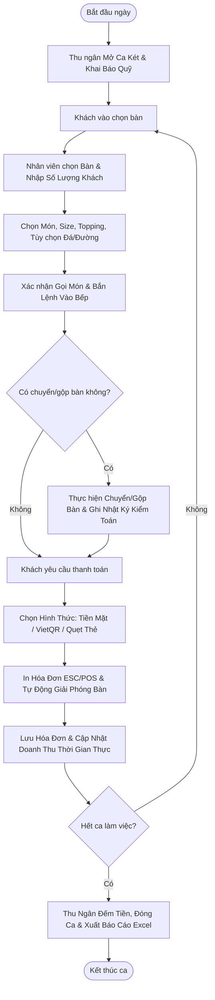

# TÀI LIỆU KỸ THUẬT HỆ THỐNG POS TRẠM
## HỆ THỐNG QUẢN LÝ BÁN HÀNG & CHUỖI CỬA HÀNG F&B ĐA NỀN TẢNG
*(Trạm F&B Management System - Enterprise Architecture & Technical Specification)*

---

## MỤC LỤC
1. [TỔNG QUAN HỆ THỐNG](#1-tổng-quan-hệ-thống)
2. [KIẾN TRÚC TỔNG THỂ & CÔNG NGHỆ](#2-kiến-trúc-tổng-thể--công-nghệ)
3. [MÔ HÌNH HỆ SINH THÁI ĐA CỬA HÀNG (MULTI-STORE ECOSYSTEM)](#3-mô-hình-hệ-sinh-thái-đa-cửa-hàng-multi-store-ecosystem)
4. [CẤU TRÚC CƠ SỞ DỮ LIỆU & ĐỒNG BỘ THỜI GIAN THỰC (REALTIME DB SCHEMA)](#4-cấu-trúc-cơ-sở-dữ-liệu--đồng-bộ-thời-gian-thực-realtime-db-schema)
5. [CƠ CHẾ ĐỒNG BỘ DỮ LIỆU & KHỬ XUNG ĐỘT (DATA RESILIENCE & PARITY)](#5-cơ-chế-đồng-bộ-dữ-liệu--khử-xung-đột-data-resilience--parity)
6. [HỆ THỐNG PHÂN QUYỀN & BẢO MẬT (RBAC & SOVEREIGN OWNER RULE)](#6-hệ-thống-phân-quyền--bảo-mật-rbac--sovereign-owner-rule)
7. [TÍCH HỢP PHẦN CỨNG & THANH TOÁN TỰ ĐỘNG](#7-tích-hợp-phần-cứng--thanh-toán-tự-động)
8. [QUY TRÌNH VẬN HÀNH NGHIỆP VỤ CỐT LÕI](#8-quy-trình-vận-hành-nghiệp-vụ-cốt-lõi)
9. [HƯỚNG DẪN CÀI ĐẶT, VẬN HÀNH VÀ ĐÓNG GÓI SẢN PHẨM](#9-hướng-dẫn-cài-đặt-vận-hành-và-đóng-gói-sản-phẩm)

---

## 1. TỔNG QUAN HỆ THỐNG

**POS Trạm** là giải pháp phần mềm quản lý vận hành bán hàng F&B chuyên nghiệp, toàn diện theo tiêu chuẩn chuỗi F&B hiện đại (tương đương KiotViet / iPOS / CukCuk), kết hợp đồng bộ đa nền tảng:
- **Web Admin Quản trị Trung tâm (Next.js)**: Dành cho Chủ chuỗi, Giám đốc điều hành và Quản lý để kiểm soát tổng thể chuỗi cửa hàng, quản lý thực đơn, thiết lập phòng bàn, kiểm soát doanh thu, kiểm toán ca két và phân quyền nhân sự.
- **App POS Điểm Bán Hàng (Flutter)**: Dành cho Thu ngân, Nhân viên phục vụ và Bếp/Bar hoạt động mượt mà trên Thiết bị di động, Máy tính bảng (Tablet) và Máy POS chuyên dụng.
- **Hạ tầng Dữ liệu Đám mây (Firebase Realtime Database)**: Đồng bộ hai chiều theo thời gian thực (Bi-directional 2-way Realtime Syncing), tốc độ phản hồi mili-giây, đảm bảo trạng thái bàn, đơn hàng và doanh số luôn chính xác 100% giữa Web và App.

---

## 2. KIẾN TRÚC TỔNG THỂ & CÔNG NGHỆ

### 2.1. Sơ đồ Kiến trúc Phân tầng

```
               ┌────────────────────────────────────────────────────────┐
               │              FIREBASE REALTIME DATABASE                │
               │   (Cloud Realtime Pub/Sub, Scoped Stores Hierarchy)    │
               └───────────────────────┬────────────────────────────────┘
                                       │ Realtime WebSocket Stream
            ┌──────────────────────────┴──────────────────────────┐
            ▼                                                     ▼
┌───────────────────────────────┐             ┌─────────────────────────────────┐
│     WEB ADMIN DASHBOARD       │             │       FLUTTER POS APP           │
│   (Next.js 16 + React 19)     │             │     (Flutter 3.x + Dart)        │
├───────────────────────────────┤             ├─────────────────────────────────┤
│ • Multi-Store Aggregator      │             │ • Fast POS Cashier Interface    │
│ • Executive Analytics         │             │ • Table/Room Matrix Screen      │
│ • Menu & Inventory Manager    │             │ • Order Cart (Sizes & Toppings) │
│ • Table & Zone Setup          │             │ • Kitchen Display System (KDS)  │
│ • Role-Based Access Control   │             │ • Cash Shift Vault Management   │
│ • Audit Log & Fraud Analysis  │             │ • ESC/POS LAN/Bluetooth Printer │
│ • Excel Export Engine         │             │ • VietQR Napas247 Dynamic Code  │
└───────────────────────────────┘             └─────────────────────────────────┘
```

### 2.2. Stack Công nghệ Chi tiết

#### Phân hệ Web Quản trị (`/web`)
* **Framework**: Next.js 16.2.9 (App Router)
* **Thư viện UI/UX**: React 19.2.4, Tailwind CSS v4, Lucide React Icons
* **Biểu đồ & Báo cáo**: Recharts (Trực quan hóa doanh thu, dòng tiền, hiệu suất món bán chạy)
* **Xử lý Dữ liệu**: Firebase Client SDK v12.14.0, XLSX Engine (Xuất báo cáo tài chính Excel)
* **Kiểm thử & Định dạng**: ESLint v9, TypeScript

#### Phân hệ Ứng dụng POS (`/app_flutter`)
* **Framework**: Flutter 3.x / Dart 3.x
* **Quản trị State**: Provider & Reactive StreamBuilder Architecture
* **Typography & Thẩm mỹ**: Google Fonts (Be Vietnam Pro)
* **Kết nối Thiết bị ngoại vi**:
  * In hóa đơn nhiệt qua mạng LAN Socket TCP (Port 9100) & Bluetooth SPP bằng giao thức ESC/POS
  * Chia sẻ file & Xuất báo cáo Excel (`share_plus`, `excel`)
* **Kiểm thử**: Flutter Test & Widget Test (16/16 Unit Tests Pass)

---

## 3. MÔ HÌNH HỆ SINH THÁI ĐA CỬA HÀNG (MULTI-STORE ECOSYSTEM)

Hệ thống được thiết kế theo kiến trúc **Scoped Multi-Tenant Data Isolation** cho phép mở rộng không giới hạn số lượng chi nhánh cửa hàng:

```
Database Root (/)
 ├── stores/
 │    ├── TRAM01/             <-- Chi nhánh Trụ sở 01
 │    │    ├── storeInfo/
 │    │    ├── tables/
 │    │    ├── zones/
 │    │    ├── products/
 │    │    ├── categories/
 │    │    ├── kitchen_orders/
 │    │    ├── cash_shifts/
 │    │    └── audit_logs/
 │    ├── TRAM02/             <-- Chi nhánh Cửa hàng 02
 │    └── TRAM03/             <-- Chi nhánh Cửa hàng 03...
 └── [Legacy/Root Node Sync]  <-- Đồng bộ 2 chiều tương thích ngược cho TRAM01
      ├── tables/
      ├── products/
      └── categories/
```

### 3.1. Cơ chế Cô lập & Tương thích ngược (Dual-Sync Mechanism)
* **Tương thích ngược (Backward Compatibility)**: Nhánh mặc định `TRAM01` (Trụ sở chính) luôn được đồng bộ 2 chiều song song giữa `/stores/TRAM01` và các node gốc `/tables`, `/products`, `/categories`, `/zones`, `/bills`, `/history`. Bất kỳ thao tác thêm/sửa/xóa nào trên Web hay App đều ghi nhận đồng thời ở cả 2 node.
* **Độc lập chi nhánh mới**: Các cửa hàng tạo mới (`TRAM02`, `TRAM03`...) được lưu độc lập hoàn toàn trong node con `/stores/{STORE_CODE}`, không làm ảnh hưởng đến dữ liệu của các cửa hàng khác.
* **Chế độ xem Tổng quan Chuỗi (Chain-wide Aggregation)**: Trên Web Admin, khi chọn chế độ `"Tất cả chi nhánh"` (`ALL`), hệ thống tự động gộp (flatten) dữ liệu từ toàn bộ các chi nhánh để tính toán:
  * Doanh thu tổng hợp chuỗi
  * Số lượng bàn đang có khách toàn hệ thống
  * So sánh hiệu quả kinh doanh giữa các chi nhánh
  * Kiểm toán nhật ký thao tác toàn chuỗi

---

## 4. CẤU TRÚC CƠ SỞ DỮ LIỆU & ĐỒNG BỘ THỜI GIAN THỰC (REALTIME DB SCHEMA)

### 4.1. Thông tin Cửa hàng (`storeInfo`)
```json
{
  "storeCode": "TRAM01",
  "storeName": "POS Trạm - Trụ sở 01",
  "ownerId": "UID_ROOT_OWNER_123",
  "address": "01 Trần Phú, Phường 3, TP. Đà Lạt",
  "phone": "0987654321",
  "wifiName": "Tram_Coffee_Free",
  "bankId": "MB",
  "bankAccount": "0987654321",
  "accountName": "NGUYEN THANH TAM",
  "allowStackPromotions": true,
  "defaultVatRate": 8.0,
  "kitchenPrinterIp": "192.168.1.200",
  "billPrinterIp": "192.168.1.201",
  "printerType": "LAN"
}
```

### 4.2. Danh sách Phòng Bàn (`tables`)
Key định danh chuẩn trên Firebase: `${zone}_${name}` (Ví dụ: `Khu A_A1`, `Khu B_B2`, `Mang về_Mang về`).
Hệ thống hiện tại gồm **21 bàn chuẩn** phân bố trên **5 khu vực**:
- **Khu A**: A1, A2, A3, A4, A5
- **Khu B**: B1, B2, B3, B4, B5
- **Khu C**: C1, C2, C3, C4, C5
- **Khu D**: D1, D2, D3, D4, D5
- **Mang về**: Mang về

```json
{
  "name": "A1",
  "zone": "Khu A",
  "capacity": 4,
  "inUse": true,
  "openedAt": 1771900000000,
  "guestCount": 3,
  "currentBillId": "BILL-TRAM01-20260930-001",
  "currentOrderJson": "[{\"productId\":22,\"name\":\"Bánh lăn choco chip\",\"price\":15000,\"quantity\":2,\"itemTotal\":30000,\"isSentKitchen\":true}]",
  "isReserved": false,
  "reservationCustomer": null,
  "reservationPhone": null,
  "reservationDeposit": 0,
  "actionLogsJson": "[{\"timestamp\":1771900000000,\"staffUsername\":\"admin\",\"staffFullName\":\"Quản Trị Viên\",\"action\":\"OPEN_TABLE\",\"details\":\"Mở bàn cho 3 khách\"}]"
}
```

### 4.3. Danh mục & Món Thực đơn (`products` & `categories`)
Hỗ trợ đầy đủ các tính năng F&B chuyên sâu:
* **Sizes**: Hỗ trợ nhiều kích cỡ kèm phụ thu (Ví dụ: `{'S': 0, 'M': 5000, 'L': 10000}`).
* **Toppings**: Danh sách topping kèm giá (Ví dụ: `Trân châu đen`, `Thạch phô mai`, `Kem Cheese`...).
* **Ice / Sugar Options**: Tùy chỉnh mức đường (0%, 30%, 50%, 70%, 100%) và mức đá (0%, 30%, 50%, 100%).

### 4.4. Quản lý Ca Két Tiền Thu Ngân (`cash_shifts`)
```json
{
  "id": "SHIFT-TRAM01-20260930-01",
  "storeCode": "TRAM01",
  "shiftName": "Ca Sáng (06:30 - 14:30)",
  "staffUsername": "thungan1",
  "staffFullName": "Nguyễn Thu Ngân",
  "openedAt": 1771890000000,
  "closedAt": 1771920000000,
  "status": "closed",
  "initialBalance": 500000,
  "cashSales": 3200000,
  "qrSales": 1850000,
  "cardSales": 450000,
  "totalBills": 38,
  "inAdjustments": 100000,
  "outAdjustments": 50000,
  "actualBalance": 3750000
}
```
* **Công thức tự động đối soát**:
  $$\text{calculatedBalance} = \text{initialBalance} + \text{cashSales} + \text{inAdjustments} - \text{outAdjustments}$$
  $$\text{variance} = \text{actualBalance} - \text{calculatedBalance}$$
  *(Hệ thống tự động phát hiện thừa/thiếu tiền két và highlight màu cảnh báo trên báo cáo)*.

### 4.5. Nhật ký Kiểm toán Minh bạch (`audit_logs`)
Ghi vết bất biến các thao tác nhạy cảm: `OPEN_TABLE`, `SEND_KITCHEN`, `MERGE_TABLE`, `TRANSFER_TABLE`, `PAYMENT`, `CANCEL_ITEM`, `APPLY_DISCOUNT`, `CLOSE_SHIFT`.

---

## 5. CƠ CHẾ ĐỒNG BỘ DỮ LIỆU & KHỬ XUNG ĐỘT (DATA RESILIENCE & PARITY)

### 5.1. Vấn đề Xung đột Kiểu Dữ liệu Đã Xử lý
Trong môi trường đa nền tảng (Web viết bằng JavaScript, App viết bằng Dart), sự khác biệt trong kiểu dữ liệu có thể dẫn đến crash âm thầm:
* **Trường `openedAt`**: Web có thể gửi chuỗi thời gian chuẩn ISO 8601 (`"2026-09-30T02:15:00.000Z"`), trong khi App mong đợi số nguyên millisecond.
* **Bộ Parser `TableModel.fromMap` Cải tiến**:
  ```dart
  int? openedAt;
  if (map['openedAt'] != null) {
    if (map['openedAt'] is num) {
      openedAt = (map['openedAt'] as num).toInt();
    } else {
      final str = map['openedAt'].toString();
      openedAt = int.tryParse(str) ?? DateTime.tryParse(str)?.millisecondsSinceEpoch;
    }
  }
  ```
* **Khả năng tự phục hồi key**: Nếu dữ liệu bàn bị thiếu tên bàn hoặc khu vực, hàm tự động bóc tách từ Firebase Key (ví dụ `Khu A_A2` $\rightarrow$ zone: `Khu A`, name: `A2`).
* **Cô lập lỗi theo từng phần tử (`_parseList`)**: Mỗi bàn được phân tích trong khối `try/catch` độc lập. Nếu 1 bàn có định dạng sai lệch bất thường, 20 bàn còn lại vẫn tải mượt mà, không bao giờ ngắt luồng stream của toàn bộ ứng dụng.

---

## 6. HỆ THỐNG PHÂN QUYỀN & BẢO MẬT (RBAC & SOVEREIGN OWNER RULE)

Hệ thống quản lý phân quyền theo vai trò (Role-Based Access Control) kết hợp cơ chế ghi đè đặc quyền tối thượng:

| Quyền Hạn (Permission Key) | Admin (Chủ quán) | Manager (Quản lý) | Cashier (Thu ngân) | Waiter (Phục vụ) | Kitchen (Bếp) |
|---|:---:|:---:|:---:|:---:|:---:|
| `view_dashboard` (Xem Báo cáo Tổng quan) | ✅ | ✅ | ❌ | ❌ | ❌ |
| `manage_tables` (Thêm/Sửa/Xóa Phòng Bàn) | ✅ | ✅ | ❌ | ❌ | ❌ |
| `order_food` (Gọi món / Thêm món) | ✅ | ✅ | ✅ | ✅ | ❌ |
| `merge_transfer_tables` (Chuyển / Gộp Bàn) | ✅ | ✅ | ✅ | ❌ | ❌ |
| `apply_discounts` (Áp dụng Giảm giá) | ✅ | ✅ | ❌ | ❌ | ❌ |
| `process_payment` (Thanh toán & Đóng Bàn) | ✅ | ✅ | ✅ | ❌ | ❌ |
| `manage_cash_shift` (Mở / Đóng Ca Két Tiền) | ✅ | ✅ | ✅ | ❌ | ❌ |
| `manage_menu` (Quản lý Món & Giá) | ✅ | ❌ | ❌ | ❌ | ❌ |
| `manage_roles_permissions` (Phân Quyền) | ✅ | ❌ | ❌ | ❌ | ❌ |
| `view_audit_logs` (Xem Nhật Ký Kiểm Toán) | ✅ | ✅ | ❌ | ❌ | ❌ |

### Quy tắc Chủ Quán Tối Thượng (Sovereign Owner Rule)
Hàm kiểm tra quyền `can()` áp dụng nguyên tắc: Nếu `isRootOwner == true` hoặc `currentUser.uid == storeInfo.ownerId`, hệ thống lập tức trả về `true` cho mọi yêu cầu quyền hạn, không phụ thuộc vào cấu hình vai trò con.

---

## 7. TÍCH HỢP PHẦN CỨNG & THANH TOÁN TỰ ĐỘNG

### 7.1. Tự động sinh mã VietQR Napas 24/7
Hệ thống tự động biên dịch đường dẫn ảnh QR động theo chuẩn định dạng VietQR:
$$\text{URL} = \text{https://img.vietqr.io/image/}\{\text{bankId}\}-\{\text{bankAccount}\}-\text{compact2.png?amount=}\{\text{totalAmount}\}\&addInfo=\{\text{billInfo}\}\&accountName=\{\text{accountName}\}$$
* Tự động điền số tiền cần thanh toán chính xác đến từng đồng.
* Nội dung chuyển khoản gắn liền với mã bàn và mã hóa đơn, giúp thu ngân và khách hàng đối chiếu tức thì mà không cần nhập tay.

### 7.2. In Hóa Đơn Nhiệt ESC/POS Đa Kênh
* **Kết nối Mạng LAN (Ethernet/WiFi)**: Kết nối qua TCP Socket đến cổng `9100` của máy in hóa đơn.
* **Kết nối Bluetooth SPP**: Ghép nối trực tiếp với máy in hóa đơn di động cầm tay (Mobile POS Printer).
* **Tách luồng in thông minh**:
  * **Phiếu Thanh Toán (Bill Receipt)**: In đầy đủ Logo, Tên quán, Mã hóa đơn, Chi tiết từng món, Size, Topping, Giảm giá, VAT, QR Code và Lời cảm ơn.
  * **Phiếu Báo Bếp (Kitchen Ticket)**: Chỉ in các món mới được gọi, ghi chú món (VD: `Ít đường, không đá`), khu vực bàn và thời gian gọi để bếp thực hiện ngay lập tức.

---

## 8. QUY TRÌNH VẬN HÀNH NGHIỆP VỤ CỐT LÕI



---

## 9. HƯỚNG DẪN CÀI ĐẶT, VẬN HÀNH VÀ ĐÓNG GÓI SẢN PHẨM

### 9.1. Yêu cầu Môi trường
* **Node.js**: Phiên bản 18.x trở lên (Khuyến nghị Node 20 LTS)
* **Flutter SDK**: Phiên bản 3.24.x trở lên, Dart 3.5.x
* **Nền tảng mục tiêu**: Web, Android (API 21+), iOS (iOS 13+), Windows/macOS Desktop

### 9.2. Khởi chạy Phân hệ Web Admin
```bash
# 1. Di chuyển vào thư mục web
cd web

# 2. Cài đặt các gói phụ thuộc
npm install

# 3. Khởi chạy môi trường phát triển (Development)
npm run dev
# Hệ thống sẽ mở tại http://localhost:3000

# 4. Đóng gói bản Production
npm run build
npm run start
```

### 9.3. Khởi chạy Phân hệ App Flutter POS
```bash
# 1. Di chuyển vào thư mục app_flutter
cd app_flutter

# 2. Tải các gói thư viện Flutter
flutter pub get

# 3. Chạy kiểm thử tự động
flutter test

# 4. Chạy ứng dụng trên thiết bị giả lập hoặc máy thật
flutter run

# 5. Đóng gói cài đặt Android (APK / App Bundle)
flutter build apk --release
flutter build appbundle --release
```

---
*Tài liệu kỹ thuật được xây dựng và chuẩn hóa cho toàn bộ Hệ thống POS Trạm.*
